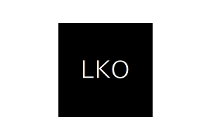

# SVG-Logo_Maker

  ## License
   
 
  (https://www.gnu.org/licenses/gpl-3.0)

  ## Description
  A `Node.js` command-line application that takes in user input to generate a logo and save it as a `SVG` file. The application prompts the user to select a shape, shape color, shape size, text, and text color. The file will be stored based on the named fields to allow multiple logo files.

  ## Table of Contents
  - [License](#license)
  - [Installation](#installation)
  - [Usage](#usage)
  - [Contribution](#contribution)
  - [Test](#test)
  - [Badges](#badges)
  - [Features](#features)

  ## Installation
  Clone: https://github.com/jeremiahmiranda79/SVG-Logo_Maker

  run `npm i` in a bash terminal to install all dependancies.  

  ## Usage
  In a bash terminal use `npm run test` to run test cases. Or use `node index` to start the application.

  ## Contribution
  I used my `README.md` file generator to create this `README.md` 😉.

  GitHub: https://github.com/jeremiahmiranda79/SVG-Logo_Maker

  Email: jeremiahmiranda79@gmail.com

  ## Test
  To run `JEST` use a Bash terminal and run `npm run test`.

  ## Badges
     

  ## Features
  TODO: Manually add you features here(for now 😉)!!!

  

  

  

  

  View a walk through here: https://drive.google.com/file/d/1XuJDMr0xMCYskznBK0QhCvEkGUrekL0t/view